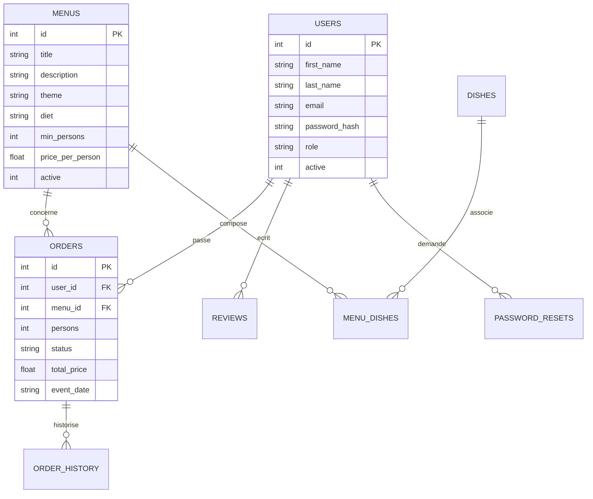
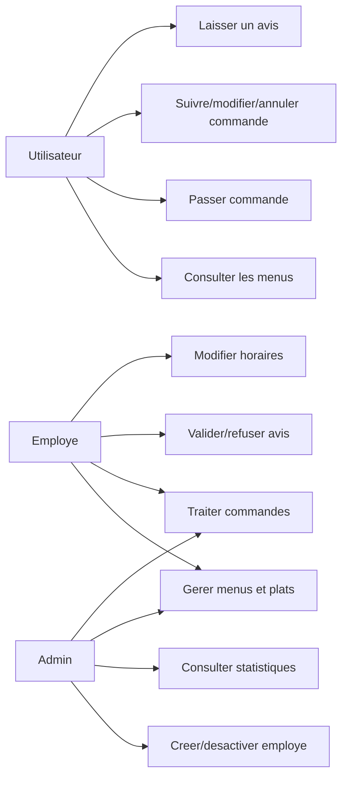
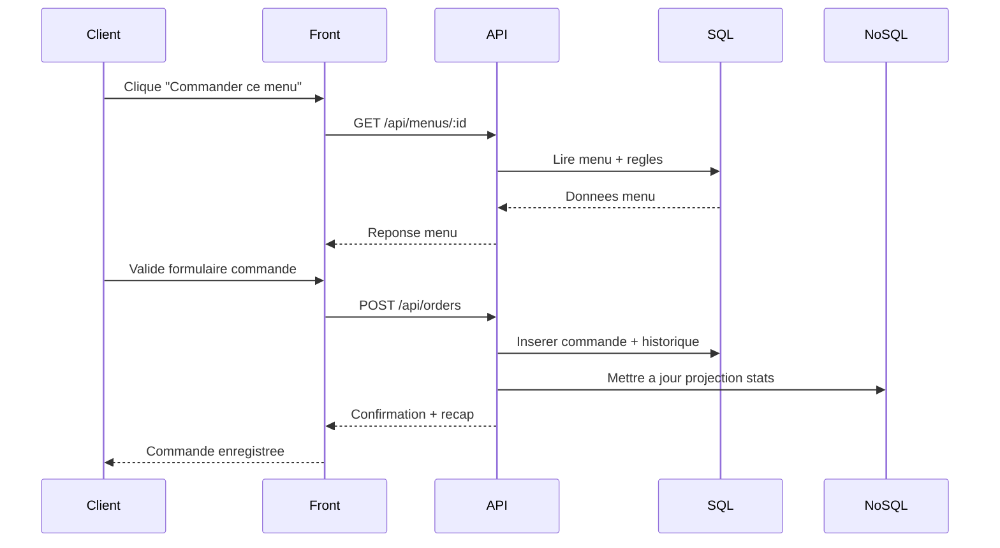
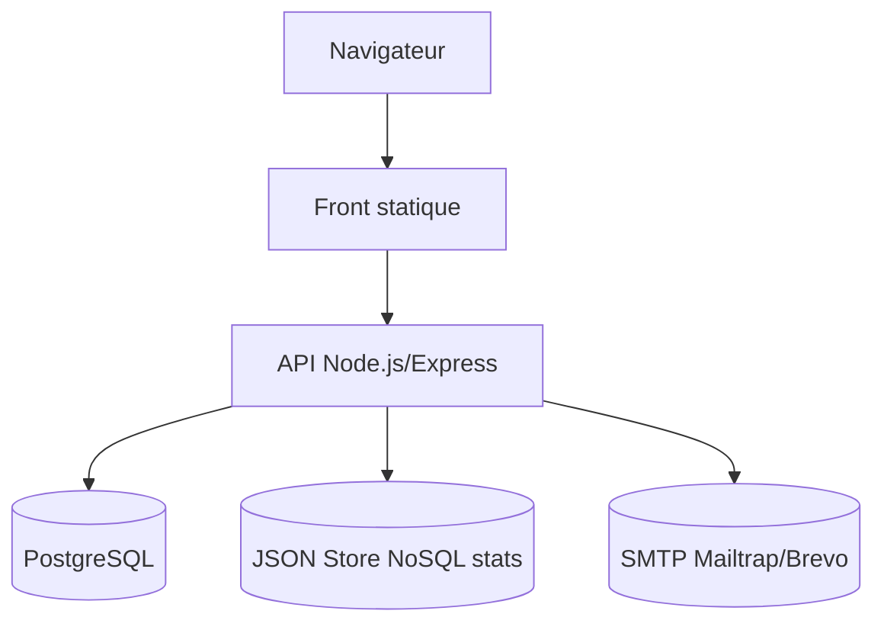

# Diagrammes UML/MCD - Vite & Gourmand

## 1) MCD simplifie (entites principales)

## 2) Cas d'utilisation (simplifie)

## 3) Sequence - parcours commande

## 4) Deploiement logique (simplifie)

